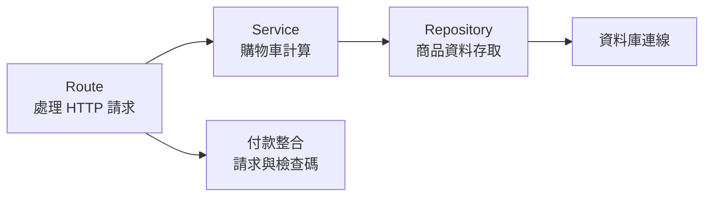

# 電商程式架構

以購物車與付款流程展示 Flask 應用的職責分工。

```mermaid
flowchart LR
    Route[Route<br/>處理 HTTP 請求] --> Service[Service<br/>購物車計算]
    Service --> Repository[Repository<br/>商品資料存取]
    Route --> Payment[付款整合<br/>請求與檢查碼]
    Repository --> Database[資料庫連線]
```

程式碼展示分層方式；完整結帳與金流流程仍在整理，尚未完成端到端驗證。
